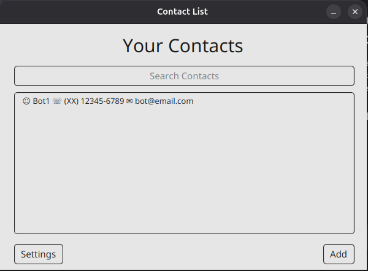
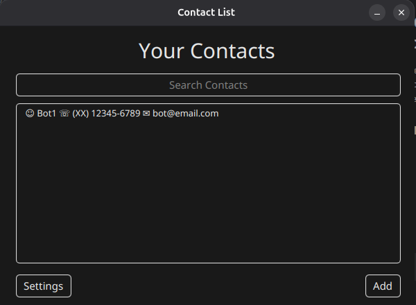

## 🖥 Contact List (Desktop Software)
This project consists of implementing a simple and intuitive desktop application for contact management.

### 🖼 Presentation:



### 💡 Features:
1. Contact registration (Name, Phone, and Email).
2. Editing existing contacts.
3. Active search for registered contacts.
4. Deleting contacts.
5. Theme customization (light/dark).

### ⚙ Technologies Used:
1. Java 21+ (Programming Language).
2. JavaFX 21+ (Framework For Interfaces).
3. Maven (Dependencies Manager).
4. SceneBuilder (FXML Builder).
5. CSS (Styling).
5. SQLite (Local Database).

### 🛠 Instalation:
1. In the releases tab, there are files available for download.
2. Choose the file according to your SO.
3. Windows (.exe/.msi), Linux (.deb) and Mac (.dmg).
4. Install the file.
5. Enjoy.

### 🧩 Usage:
1. __Add Contact:__ On the home screen, click the "Add" button in the bottom right corner of the screen. On the new screen,
fill in the details (Name, Phone, and Email) and click "Send".
2. __Editing Contacts:__ On the main screen, contacts are listed in the center. To edit, simply double-click on the contact
and change the information. When finished, click "Save".
3. __Contact Search:__ On the main screen, there is a search bar located at the top. To search, simply add the name of
the contact in search bar. <br>
__Note:__ Search by phone number and email address has not been implemented in the current version.
4. __Deleting Contacts:__ On the main screen, there is a list of all registered contacts. Double-click on a specific contact
to open the edit menu. In the edit menu, click "Delete".
5. __Theme Customization:__ In the bottom left corner of the main screen there is a "Settings" button, click on it. On
the new screen click on "Interface" and choose your preferred theme.

### 📂 Folder Structure:
The project was structured following design patterns to separate business logic from the visual interface:
```text
src/main/java/com/agenda/
 ├── controller/  # Controlling the interface logic (events).
 ├── dao/         # Data access (Persistence).
 ├── model/       # Entity classes (Contact).
 └── view/        # Initialization main class.

src/main/resources/com/agenda/
 ├── css/         # Stylesheets for the interface.
 └── fxml/        # Screen layout files.

